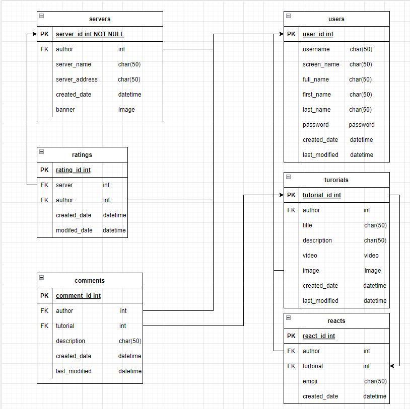
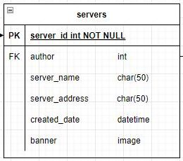
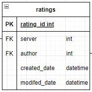
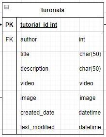
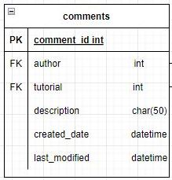
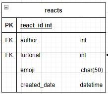
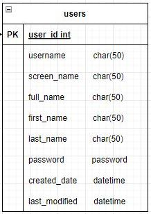

# Cadius Community API

The Cadius Comunity API is a backend structure using DRF "Django Rest Framework".

To visit the live version of the backend (hosted by Heroku) click [here](https://api-cadius.herokuapp.com/)

## UX

### Wireframes and Designs

Below is the ERD for this project.



## Technologies Used

During development of the site a number of programs and web based applications were used. You can find a list of the below:

[DrawIO](https://drawio-app.com/) - Used to create the Entity Relationship Diagram

[Github](https://github.com/) - Used to host the project

[Gitpod](https://www.gitpod.io/) - Used as a cloud based IDE to code the project

[GIT](https://en.wikipedia.org/wiki/Git) - Used for version control

[Heroku](https://www.heroku.com/) - Used to host the deployed site

Plugins that was used to develop this site are:

[REST](https://www.django-rest-framework.org/) - Used for the backend framework

[Django](https://www.djangoproject.com/) - Used for the project framework

Code that was used to develop this site are:

[Python](https://www.python.org/) - Used for backend coding

## Data Model

- __Servers Model__
    - This model holds all gaming servers that users have added.
    - This model links to the Ratings model on the Server_id.



- __Ratings Model__
    - This model holds all the ratings for the servers model.
    - a user will be able to rating the server from 1-5 stars.



- __Tutorials Model__
    - This model holds all user tutorial posts.
    - These posts can consist of user guides or videos.



- __Comments Model__
    - This model holds all the user comments made on a tutorial post.
    - This links to both the tutorial model and Django User model.



- __Reacts Model__
    - This model handles all the emojis that users react with on a tutorial post.



- __Profile Model__
    - This model will handle the profile of the user.




## Testing

For all testing, please refer to the [TESTING.md](TESTING.md) file.

## Deployment

The site was deployed to Heroku. The steps to deploy are as follows: 
- We need to install everything in the requirements.txt file. To do this we run the following command 
 
    ```pip3 install -r requirements.txt```
- Login / signup to [Heroku](https://id.heroku.com/login)
- On the dasboard, once logged in, click New and then click Create new app
- Give the App a name and select your region, then click create app
- Click resources and in the add-ons search for `Heroku Postgres`. Select the free version and click submit order form.
- Login / signup to [Cloudinary](https://cloudinary.com/)
- On the dashboard, once logged in, click the API Environment Variable to copy it
- Navigate back to Heroku and the app you created earlier
- Click settings and then click Reveal config Vars. This is where we need to set a couple of things.
- In the Key box enter `CLOUDINARY_URL` and in the value enter the API Environment Variable you copied earlier. Before clicking add, remove `CLOUDINARY_URL=` from the value field
- In the Key box enter `PORT` and in the value enter `8000` then click add
- In the Key box enter `SECRET_KEY` and in the value enter a random key then click add
- Click deploy from the menu at the top, then click github.
- enter the repositry name and click search. if found the repositry will appear below, click connect.

[Link to deployed site](https://api-cadius.herokuapp.com/)

### Local Deployment

if you would like to make a clone of this repository, you can type the following command in your iDE terminal:

- `git clone https://github.com/robcole-dev/api-cadius-community.git`

Alternatively, if using Git pod, you can click below to create your own workspace using this repository.

[](https://github.com/robcole-dev/api-cadius-community)

Please make sure to install the requirements using ```pip3 install -r requirements.txt``` in your terminal

## Credits 

### Acknowledgments

- Aura Cole (My Wife)
- The community over on Code Institute's Slack