# Testing

Below is a list of test that have been carried out with screenshots.

## Code Validation
__Code Validation__

__Python__

No errors were returned when passing throught the offical PEP8 Validation

__API Cadius Project Files__

- Settings.py

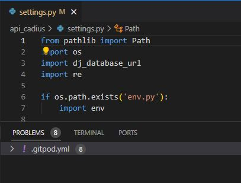
- urls.py

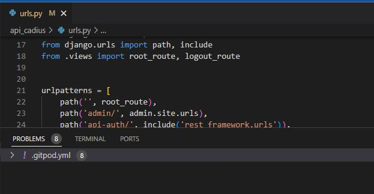
- permissions.py

- serializers.py

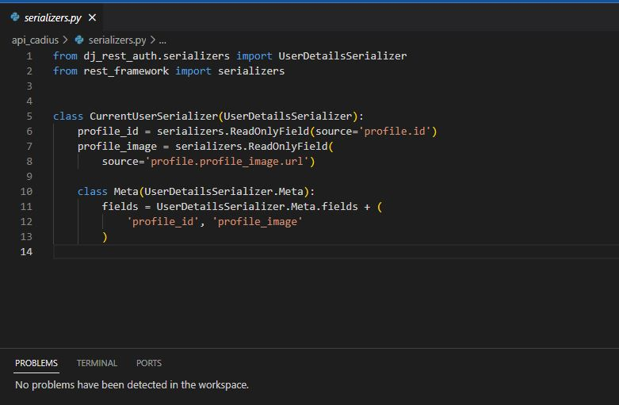
- views.py

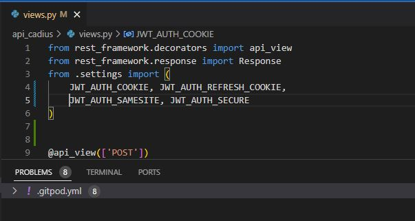

__Comments App__

- models.py

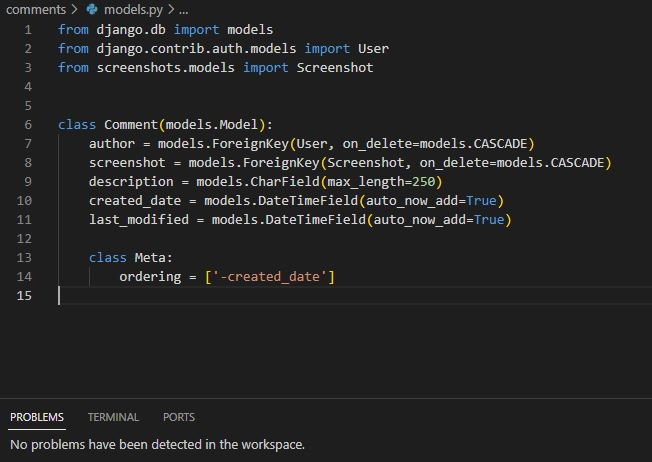
- views.py

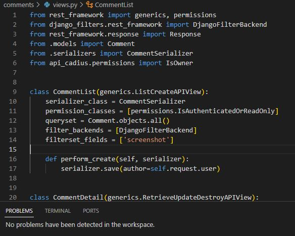
- serializers.py

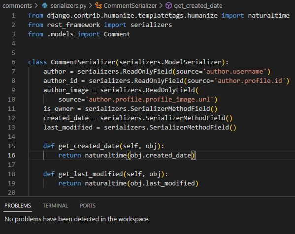
- urls.py

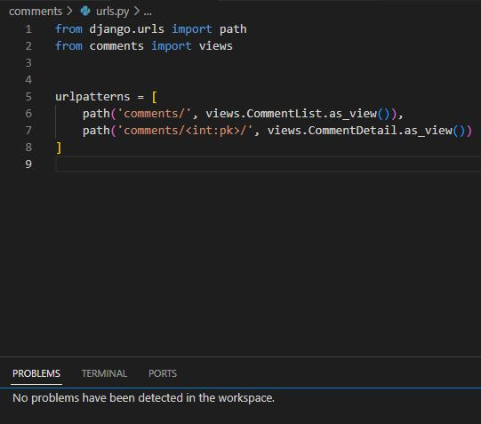

__Emojis App__

- models.py

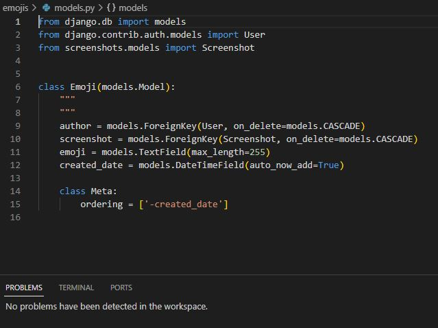
- views.py

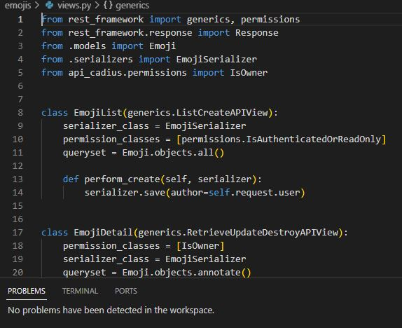
- serializers.py

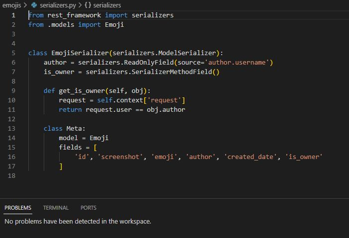
- urls.py

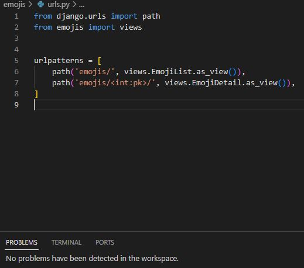

__Profiles App__

- models.py

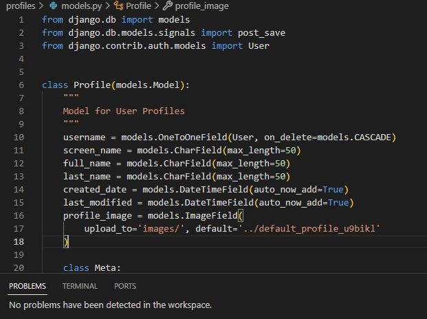
- views.py

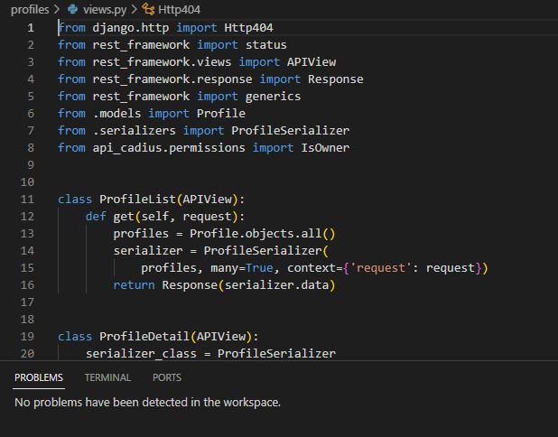
- serializers.py

- urls.py

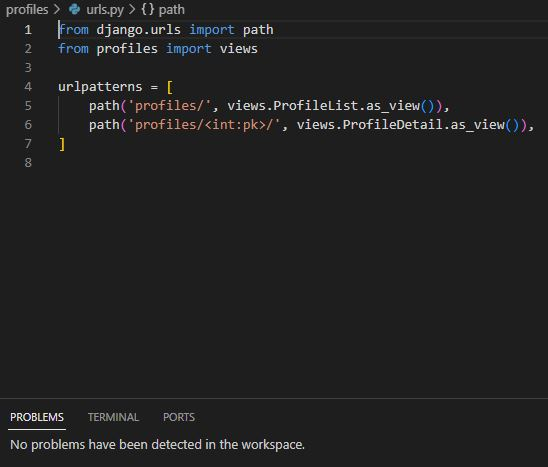

__Ratings App__

- models.py

- views.py

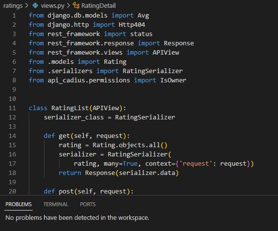
- serializers.py

- urls.py

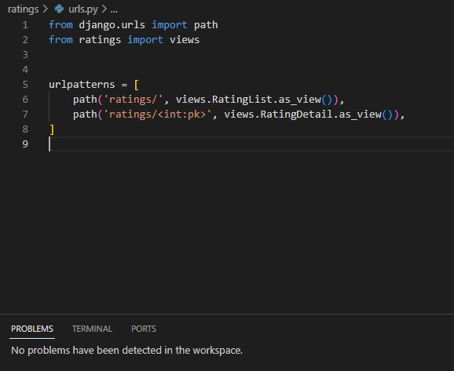

__Screenshots App__

- models.py

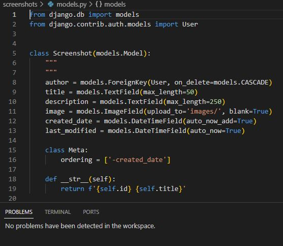
- views.py

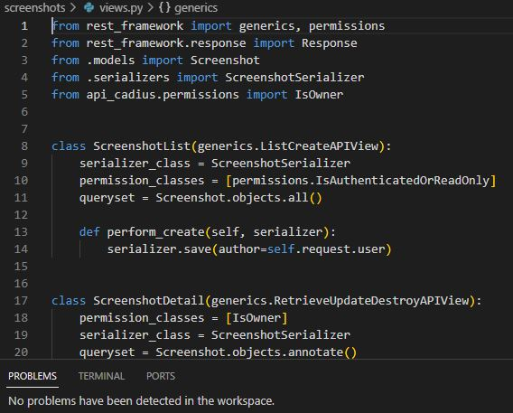
- serializers.py

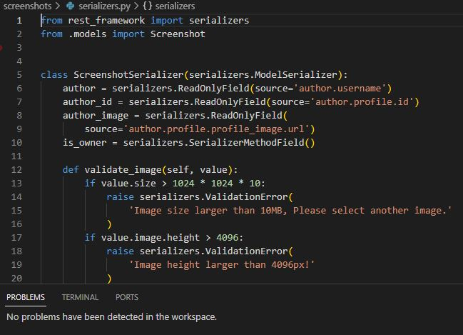
- urls.py

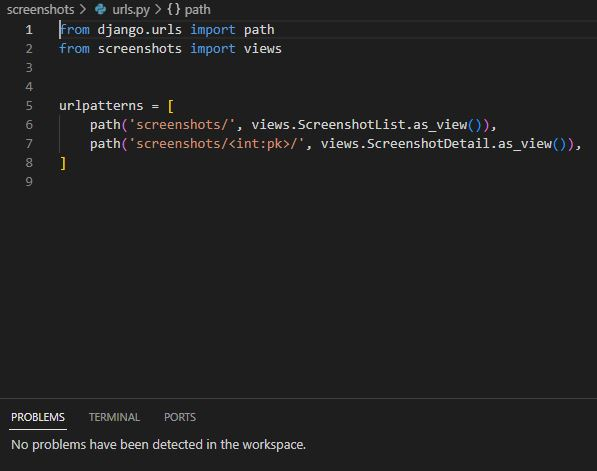

__Servers App__

- models.py

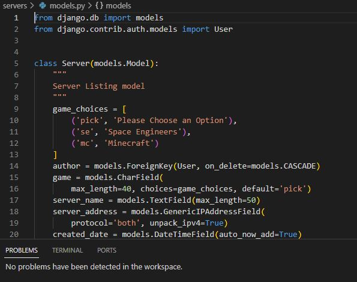
- views.py

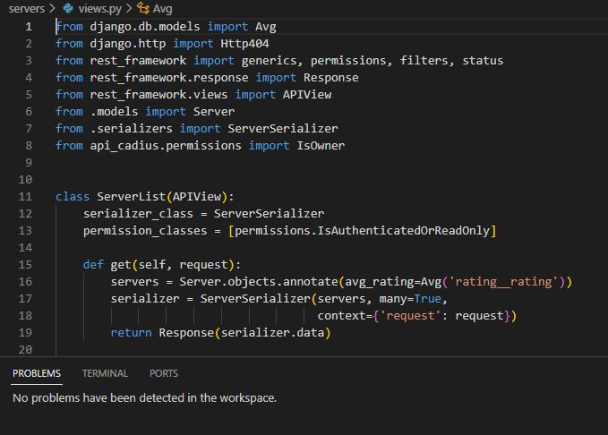
- serializers.py

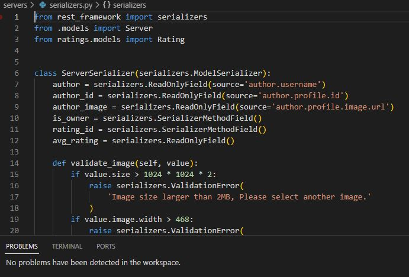
- urls.py

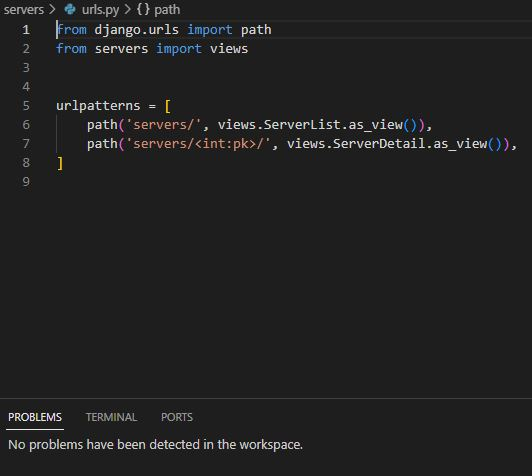