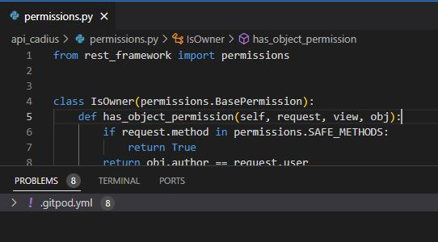
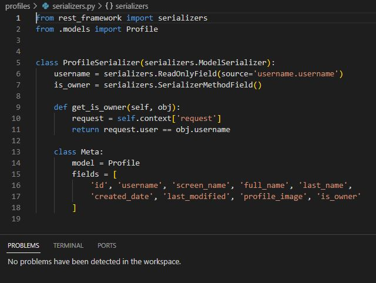
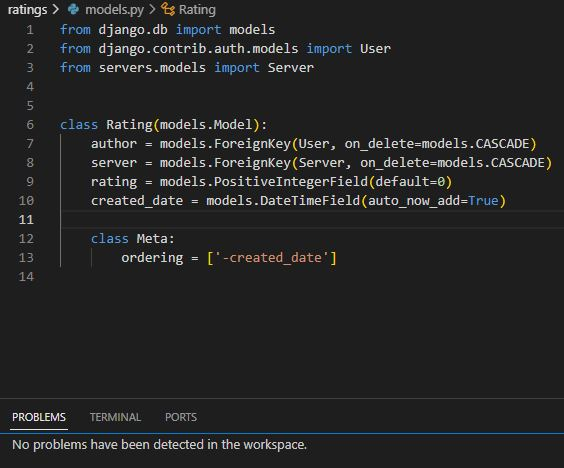
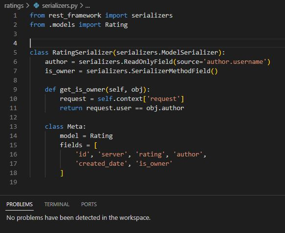

# Testing

Below is a list of test that have been carried out with screenshots.

## Code Validation
__Code Validation__

__Python__

No errors were returned when passing throught the offical PEP8 Validation

__API Cadius Project Files__

- Settings.py

- urls.py

- permissions.py

- serializers.py

- views.py

__Comments App__

- models.py

- views.py

- serializers.py

- urls.py

__Emojis App__

- models.py

- views.py

- serializers.py

- urls.py

__Profiles App__

- models.py

- views.py

- serializers.py

- urls.py

__Ratings App__

- models.py

- views.py

- serializers.py

- urls.py

__Screenshots App__

- models.py

- views.py

- serializers.py

- urls.py

__Servers App__

- models.py

- views.py

- serializers.py

- urls.py

